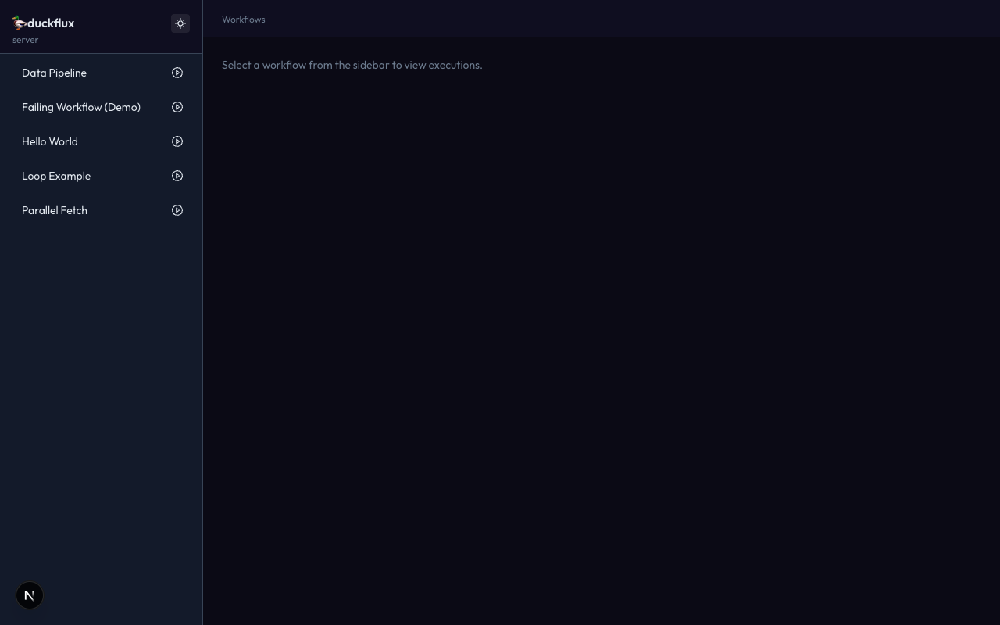
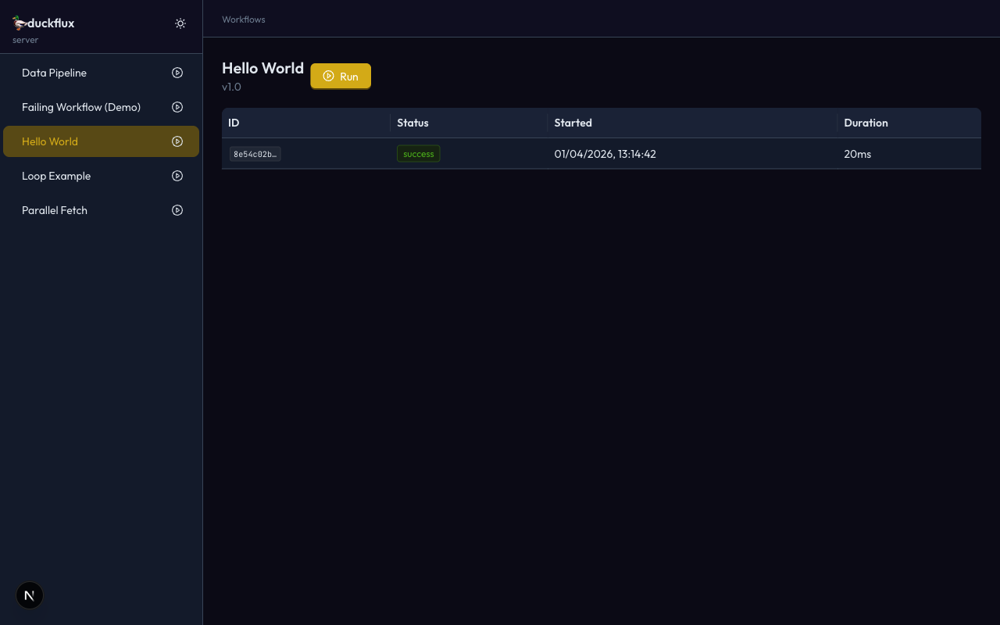
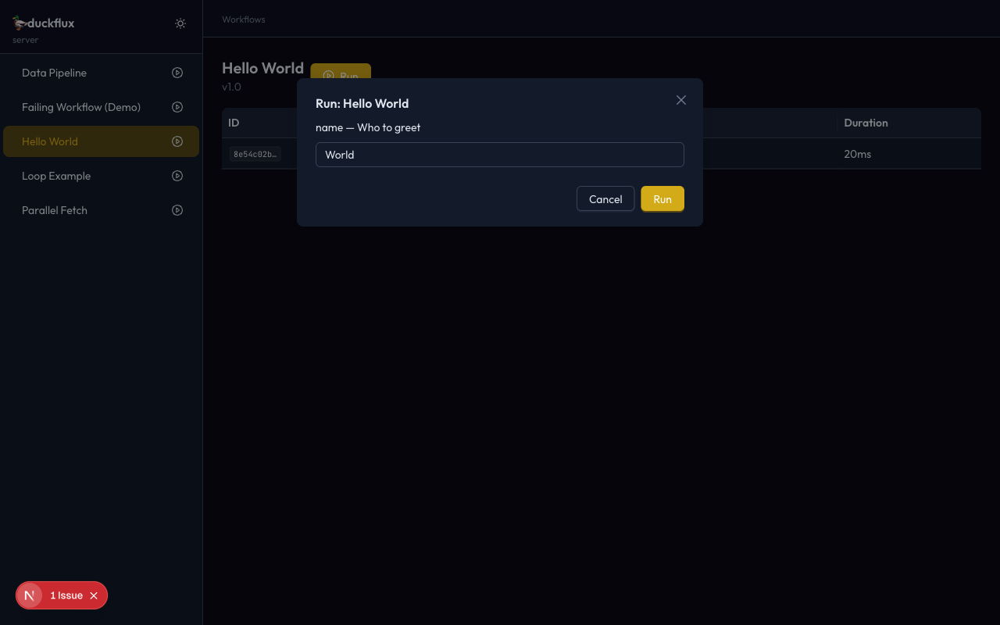
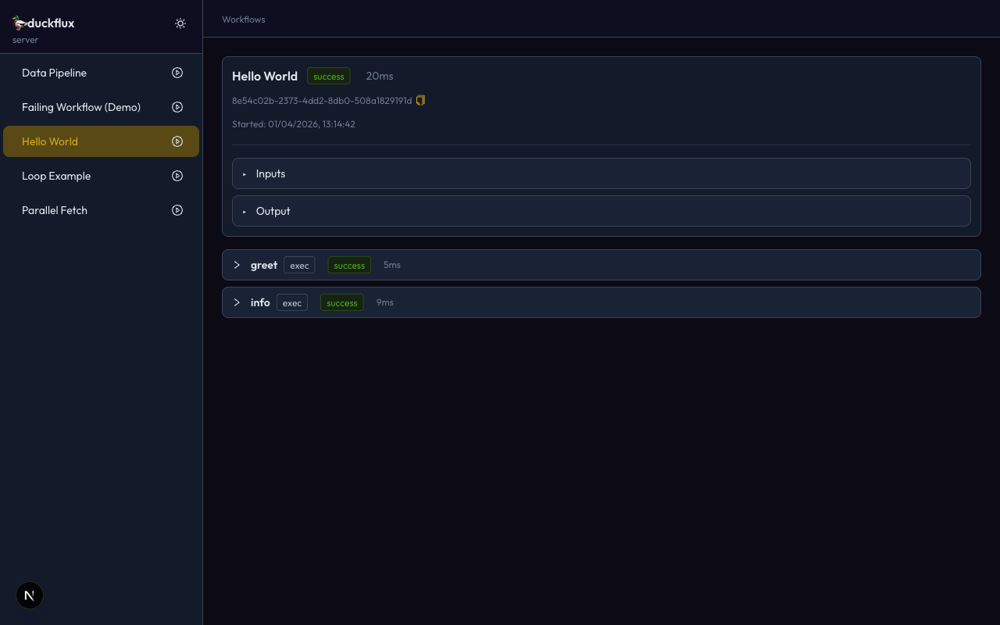
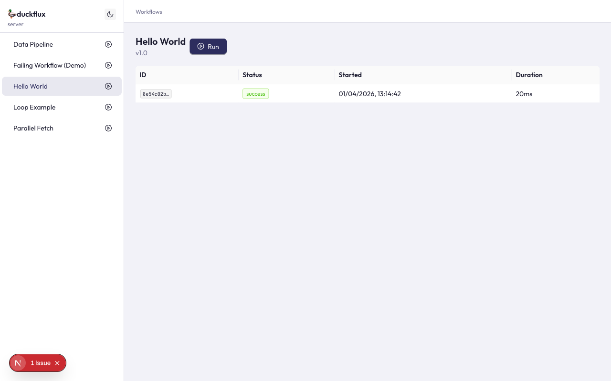

import { Aside, Tabs, TabItem } from '@astrojs/starlight/components';

The **duckflux server** is a local web UI for running and inspecting workflows — think GitHub Actions, but for your duckflux flows. It ships as the `@duckflux/server` package and is launched via the [`duckflux server`](/runtime/cli/#server) CLI command.



---

## Quick start

```bash
# 1. Make sure you have trace output enabled
duckflux server --trace-dir ./traces --workflow-dir ./workflows

# 2. Open the UI
#    → http://localhost:3000
```

The server scans `--workflow-dir` for `.yaml` / `.yml` files and watches `--trace-dir` for trace JSON files. New traces appear in the UI in real time via Server-Sent Events.

---

## CLI flags

| Flag | Type | Default | Description |
|------|------|---------|-------------|
| `--trace-dir` | string | — | **Required.** Directory to watch for execution trace JSON files. Created automatically if it doesn't exist. |
| `--workflow-dir` | string | cwd | Directory to scan for workflow files (recursive). |
| `--port` | string | `3000` | HTTP port for the web UI. |

<Aside type="note">
  The `--trace-dir` flag is consistent with the [`duckflux run --trace-dir`](/runtime/cli/#flags) flag. Point both commands at the same directory to see CLI-triggered executions in the server UI.
</Aside>

---

## Features

### Workflow sidebar

The left sidebar lists all discovered workflows, sorted alphabetically. Each entry shows the workflow name (or relative file path if unnamed) and a play button for quick execution.

Clicking a workflow navigates to its detail page showing execution history.

### Workflow detail and execution history



The detail page shows:

- **Workflow name** and **version**
- A **Run** button that opens the execute modal
- A **table of past executions** with ID, status badge, start time, and duration
- Click any row to drill into the trace viewer

### Execute modal



Clicking **Run** on any workflow opens a modal with a dynamically generated form based on the workflow's `inputs` schema:

| Input type | Form control |
|------------|-------------|
| `string` | Text input |
| `number` / `integer` | Number input (with `min` / `max` from schema) |
| `boolean` | Toggle switch |
| `enum` | Dropdown select |

Default values from the schema are pre-filled. The workflow is executed server-side and the result appears in the execution table once the trace file is written.

### Trace viewer



The trace viewer provides a GitHub Actions-style breakdown of a single execution:

- **Execution header** — workflow name, status badge (success / failure / running), total duration, execution ID with copy button, and start timestamp
- **Inputs / Output** — collapsible JSON viewers for the execution-level inputs and final output
- **Step panels** — one collapsible panel per step, showing:
  - Step name, participant type, status badge, and duration
  - Loop index and retry count (when applicable)
  - Error message (for failed steps)
  - Collapsible Input / Output JSON viewers per step

### Real-time updates

The server uses **Server-Sent Events (SSE)** to push updates to the browser:

1. A [chokidar](https://github.com/paulmillr/chokidar) file watcher monitors `--trace-dir` for `*.json` changes
2. New or updated trace files trigger SSE events (`trace:new`, `trace:updated`)
3. The browser receives events and refreshes the relevant data via [SWR](https://swr.vercel.app/)

This means you can run workflows from the CLI in one terminal and watch them appear in the UI instantly.

### Dark / light mode



The UI ships with both dark and light themes following the duckflux brand identity. Toggle between them using the sun/moon button in the sidebar header. The preference is saved to `localStorage` and respects your system's `prefers-color-scheme` setting on first visit.

---

## Architecture

The server runs as a single Next.js process — the API routes and the UI are served from the same port. No separate API server or proxy configuration needed.

```
┌─────────────────────────────────────┐
│          Next.js (port 3000)        │
│                                     │
│  ┌──────────┐    ┌───────────────┐  │
│  │  React   │    │  API Routes   │  │
│  │   UI     │ ←→ │  /api/*       │  │
│  │ (antd 5) │    │  (SSE, REST)  │  │
│  └──────────┘    └───────┬───────┘  │
│                          │          │
│                   ┌──────┴───────┐  │
│                   │  chokidar    │  │
│                   │  watcher     │  │
│                   └──────┬───────┘  │
└──────────────────────────┼──────────┘
                           │
                    ┌──────┴───────┐
                    │  trace-dir/  │
                    │  *.json      │
                    └──────────────┘
```

### API endpoints

| Method | Path | Description |
|--------|------|-------------|
| `GET` | `/api/workflows` | List all discovered workflows |
| `GET` | `/api/workflows/:id` | Get a single workflow's metadata |
| `GET` | `/api/executions` | List all executions (optional `?workflowId=` filter) |
| `GET` | `/api/executions/:id` | Get a single execution trace |
| `POST` | `/api/execute` | Execute a workflow (fire-and-forget) |
| `GET` | `/api/events` | SSE stream of trace events |

### Tech stack

| Layer | Technology |
|-------|-----------|
| UI framework | [Next.js 15](https://nextjs.org/) (App Router) |
| Component library | [Ant Design 5](https://ant.design/) |
| Data fetching | [SWR](https://swr.vercel.app/) |
| File watching | [chokidar 4](https://github.com/paulmillr/chokidar) |
| Workflow engine | `@duckflux/core` |

---

## Package details

- **npm package:** `@duckflux/server`
- **Binary:** `duckflux-server`
- **Minimum runtime:** Bun 1.x or Node.js 20+

The package is auto-installed by `duckflux server` when not present in the project. You can also install it manually:

```bash
bun add @duckflux/server -D
# or
npm install @duckflux/server --save-dev
```
